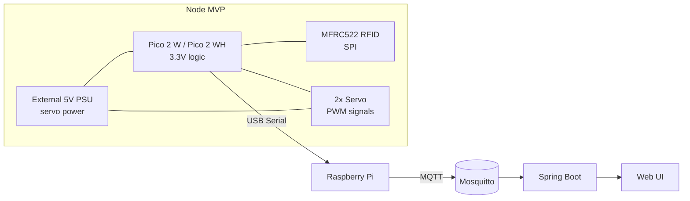

# Architecture

## 1) High-level view

Проект разделён на 4 уровня:

- **Node controller**: Raspberry Pi Pico 2 W / Pico 2 WH.
- **Hub**: Raspberry Pi с Mosquitto и serial↔MQTT bridge.
- **Backend**: Java + Spring Boot.
- **Frontend**: JS web UI.

## 2) MVP vs Future

### MVP (по умолчанию)

- Pico 2 W/Pico 2 WH
- 1–2x MFRC522
- 2x servo
- USB Serial Pico ↔ Raspberry Pi
- MQTT через bridge на Raspberry Pi

### Future

- прямой Wi‑Fi MQTT с Pico 2 W,
- много узлов Pico,
- PCA9685 для большого количества servo,
- блок-участки, сигналы, шлагбаумы.

## 3) Node firmware responsibilities

- heartbeat,
- RFID scan + подавление дублей,
- управление servo,
- serial transport protocol (MVP),
- command handler.

## 4) Electrical architecture rules

- Pico GPIO: **только 3.3V логика**.
- MFRC522 питать от 3.3V.
- Servo питать от отдельного 5V PSU.
- Обязательный **COMMON GND**.
- Нельзя подавать 5V сигналы на GPIO Pico.

## 5) Platform policy

- **Primary target**: Pico 2 W / Pico 2 WH.
- Arduino: только legacy/alternative compatibility path.
