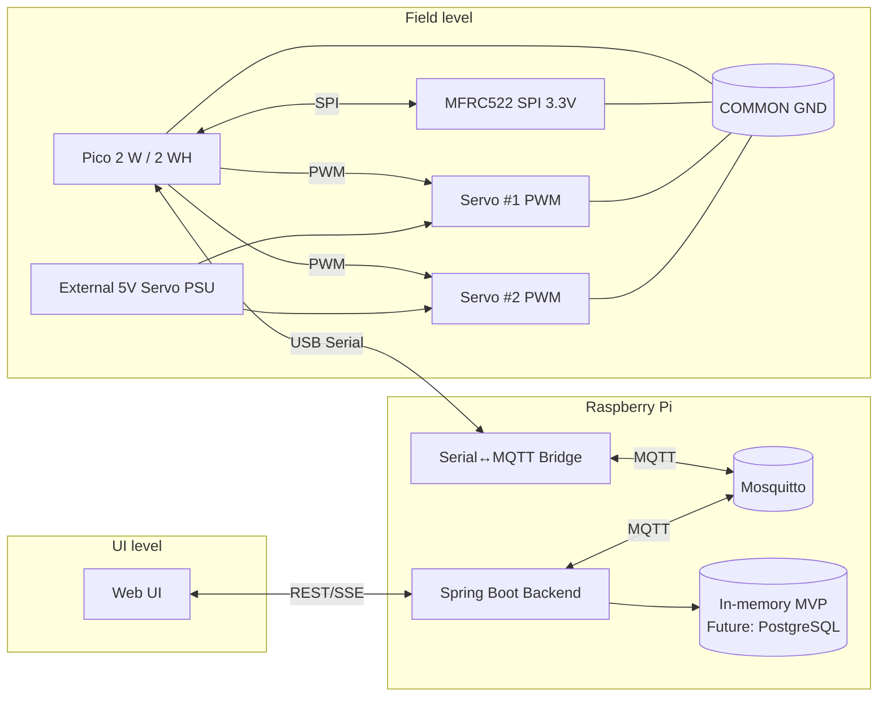
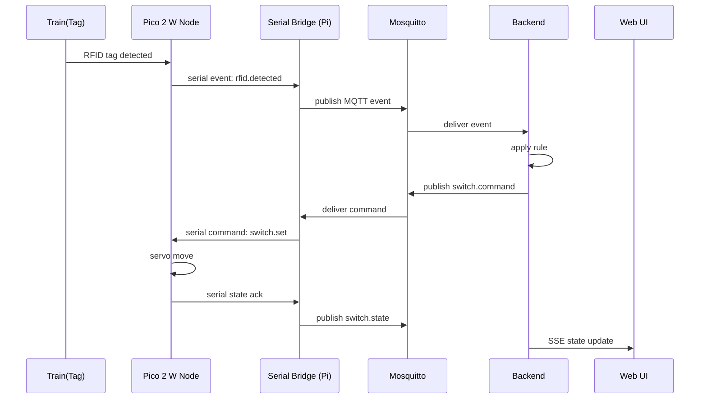
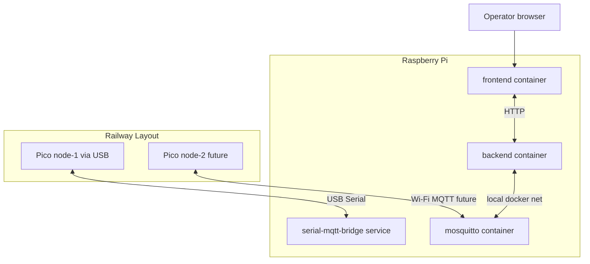

# Architecture

## 1. Общая идея

Система строится как event-driven pipeline:
- полевые узлы публикуют факты (`events`);
- backend вычисляет решение (`rules`);
- backend публикует управленческие команды (`commands`);
- полевые узлы публикуют подтверждение состояния (`state`).

В этом проекте **primary node controller = Raspberry Pi Pico 2 W / Pico 2 WH**.

## 2. MVP vs Future architecture

### MVP (default)
- Node controller: Pico 2 W / Pico 2 WH.
- Reader: MFRC522 (SPI, 3.3V logic).
- Actuators: 2 servo (external 5V power).
- Transport Pico ↔ Raspberry Pi: **USB Serial**.
- Transport Raspberry Pi ↔ backend: MQTT (Mosquitto).

### Future
- Pico 2 W подключается по Wi‑Fi напрямую к MQTT broker.
- Много узлов Pico.
- PCA9685 для большого числа servo.
- Block sections / gates / signals.

## 3. Роли компонентов

- **Pico 2 W Node**: RFID/servo, heartbeat, anti-duplicate, Serial transport (MVP).
- **Serial Bridge (на Raspberry Pi)**: перевод Serial сообщений Pico в MQTT и обратно.
- **Mosquitto**: транспорт событий/команд.
- **Spring Boot Backend**:
  - нормализация сообщений;
  - хранение текущего состояния;
  - применение правил;
  - API + live updates для UI.
- **Web UI**: наблюдение и ручные действия оператора.

## 4. Компонентная диаграмма (MVP)

## 5. Sequence (MVP USB Serial)

## 6. Deployment diagram

## 7. Важные electrical ограничения

- Pico GPIO работают на **3.3V**.
- Нельзя подавать 5V сигналы напрямую на GPIO Pico.
- MFRC522 должен работать от 3.3V.
- Servo питаются от внешнего 5V источника, не от Pico.
- **COMMON GND обязателен** между Pico, MFRC522 и servo power.

## 8. Границы ответственности

### Pico firmware
- Debounce/anti-duplicate RFID чтений.
- Исполнение servo-команды.
- Heartbeat и диагностика (uptime/errors).
- Serial protocol (MVP), future: MQTT over Wi‑Fi.

### Backend
- Каноническая модель layout и устройств.
- Rule evaluation (stateless/stateful).
- Источник истины по текущему состоянию.
- API для UI и внешних интеграций.

### UI
- Визуализация состояния.
- Журнал событий.
- Manual override (подтверждённые команды).
