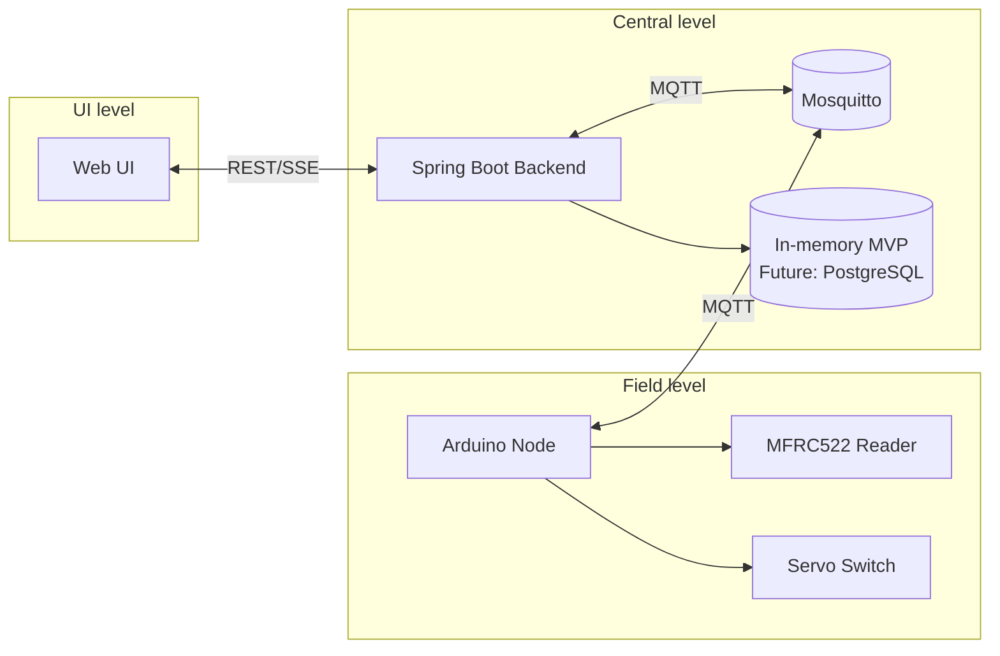
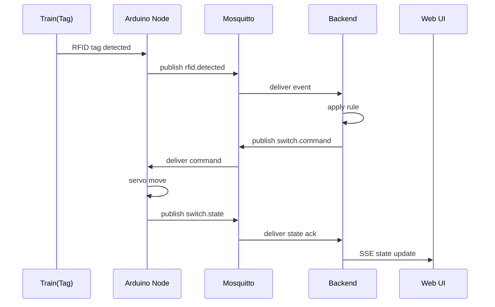
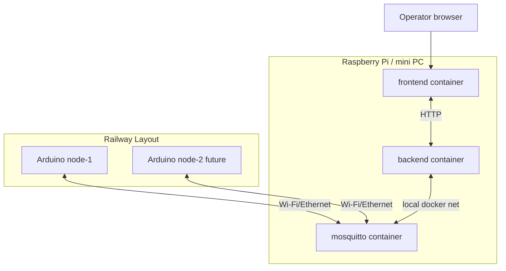

# Architecture

## 1. Общая идея

Система строится как event-driven pipeline:
- полевые узлы публикуют факты (`events`);
- backend вычисляет решение (`rules`);
- backend публикует управленческие команды (`commands`);
- полевые узлы публикуют подтверждение состояния (`state`).

## 2. Роли компонентов

- **Arduino Node**: работа с RFID/servo, heartbeat, MQTT I/O.
- **Mosquitto**: транспорт событий/команд.
- **Spring Boot Backend**:
  - нормализация сообщений;
  - хранение текущего состояния;
  - применение правил;
  - API + live updates для UI.
- **Web UI**: наблюдение и ручные действия оператора.

## 3. Компонентная диаграмма

## 4. Sequence: поезд прошёл reader -> переключилась стрелка

## 5. Deployment diagram

## 6. Границы ответственности

### Arduino
- Debounce/anti-duplicate RFID чтений.
- Исполнение servo-команды.
- Низкоуровневая диагностика (RSSI-like данные, uptime, errors).

### Backend
- Каноническая модель layout и устройств.
- Rule evaluation (stateless/stateful).
- Источник истины по текущему состоянию.
- API для UI и внешних интеграций.

### UI
- Визуализация состояния.
- Журнал событий.
- Manual override (подтверждённые команды).

## 7. Масштабирование

- Topic naming включает `nodeId`, `readerId`, `switchId`.
- Node горизонтально добавляются без изменения протокола.
- Rule engine отделён от транспорта, можно заменить реализацию.
- In-memory storage в MVP заменяется на БД без изменения API контрактов.
