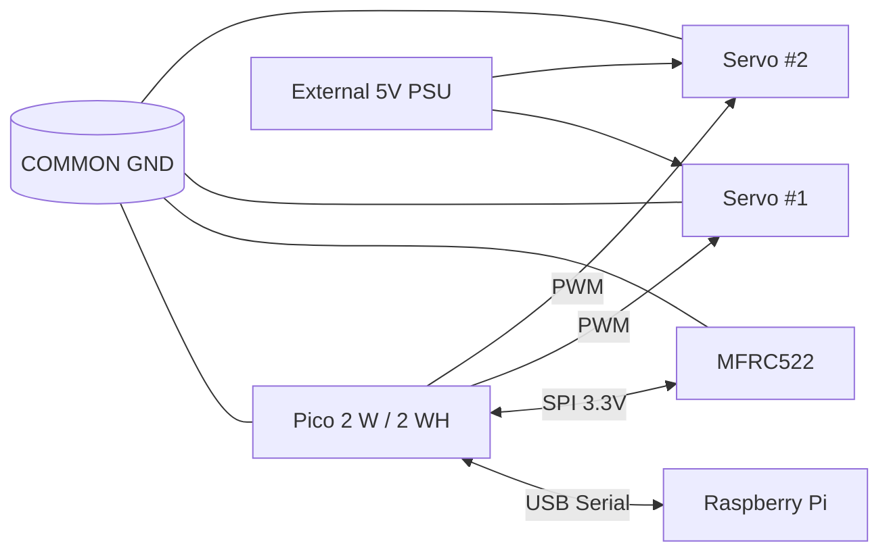

# Wiring Overview (MVP)

## MVP состав

- 1x Raspberry Pi Pico 2 W/WH
- 1x MFRC522 (SPI)
- 2x Servo (PWM)
- 1x Raspberry Pi (USB Serial bridge + MQTT/backend)

## Mermaid overview

## Что проверить до включения

- Нет 5V на GPIO Pico.
- MFRC522 питается от 3.3V.
- Servo VCC подключены только к внешнему 5V PSU.
- Все GND объединены в common ground.
