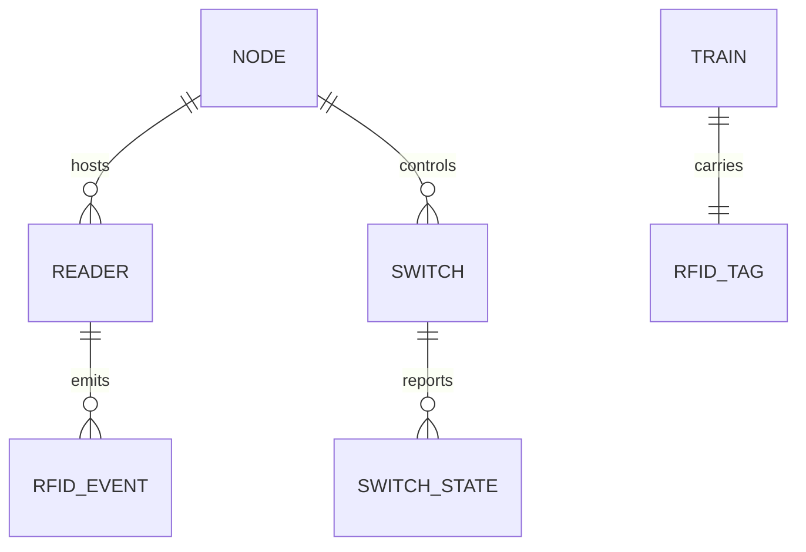

# Layout Model

## Сущности

- **Train**: физический поезд, связан с RFID tag UID.
- **Marker**: логическая метка точки маршрута.
- **Reader**: физический RFID reader на узле.
- **Switch**: стрелка с состояниями `STRAIGHT | DIVERGE`.
- **BlockSection**: участок пути для future occupancy.
- **Node**: Pico 2 W/WH контроллер с набором readers/switches.

## Идентификаторы

- `node-{n}` (пример `node-1`)
- `reader-{letter}` (пример `reader-a`)
- `sw-{n}` (пример `sw-1`)
- `train-{n}` (пример `train-1`)

## Связи

- Один `Node` содержит 1..N `Reader` и 1..N `Switch`.
- Один `Train` имеет один текущий `tagUid`.
- `Reader` генерирует события проезда для `Train`.
- `Switch` получает команды и публикует состояние.

## MVP transport field

Для node полезно хранить поле `transportMode`:
- `USB_SERIAL` (MVP default);
- `WIFI_MQTT_DIRECT` (future).

## Mermaid ER

