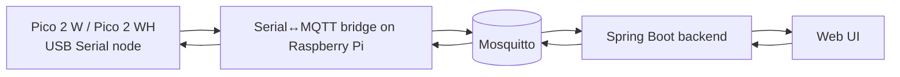

# MQTT topics (canonical, MVP)

Этот файл — **источник истины** для MQTT namespace и payload naming.
Используйте его как reference для firmware bridge, backend, frontend и examples.

## Namespace

- Базовый префикс: `brio/v1`
- Идентификатор узла в topic: `nodeId` (например `node-1`)
- Идентификаторы сущностей:
  - `readerId` (например `reader-a`)
  - `switchId` (например `sw-1`)
  - `trainId` (например `train-1`, используется в registry/rules)

## Topics (MVP)

- Heartbeat from node:
  - `brio/v1/nodes/{nodeId}/heartbeat`
- RFID event from node:
  - `brio/v1/nodes/{nodeId}/events/rfid.detected`
- Switch state ack from node:
  - `brio/v1/nodes/{nodeId}/state/switch`
- Switch command to node:
  - `brio/v1/nodes/{nodeId}/commands/switch.set`

## Payloads (MVP)

### heartbeat

```json
{
  "nodeId": "node-1",
  "status": "ONLINE",
  "uptimeSec": 1234,
  "ts": "2026-03-27T12:00:00Z"
}
```

### RFID event

```json
{
  "eventId": "evt-001",
  "nodeId": "node-1",
  "readerId": "reader-a",
  "tagUid": "04AABBCCDD",
  "ts": "2026-03-27T12:00:01Z"
}
```

### switch command

```json
{
  "commandId": "cmd-001",
  "nodeId": "node-1",
  "switchId": "sw-1",
  "targetState": "DIVERGE",
  "reason": "manual-api",
  "ts": "2026-03-27T12:00:02Z"
}
```

### switch state ack

```json
{
  "nodeId": "node-1",
  "switchId": "sw-1",
  "state": "DIVERGE",
  "source": "COMMAND",
  "ts": "2026-03-27T12:00:03Z"
}
```

## Data flow (MVP)



## Future mode

В future mode Pico 2 W может публиковать/подписываться в MQTT напрямую по Wi‑Fi.
**Topic schema и payload naming должны оставаться теми же.**
