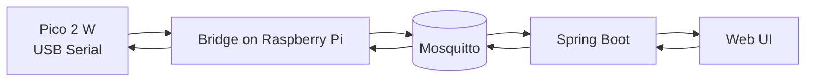

# MQTT topics

## Namespace

Используем префикс:
- `brio/`

Node id пример:
- `node-01`

## Topics (MVP)

- `brio/node/node-01/heartbeat`
- `brio/node/node-01/event/rfid`
- `brio/node/node-01/state/switch/1`
- `brio/node/node-01/state/switch/2`
- `brio/node/node-01/cmd/switch/1`
- `brio/node/node-01/cmd/switch/2`

## Payload examples

### heartbeat

```json
{
  "nodeId": "node-01",
  "ts": 1710000000,
  "uptimeMs": 123456,
  "transport": "usb-serial",
  "fw": "pico2w-mvp-0.1"
}
```

### RFID event

```json
{
  "nodeId": "node-01",
  "readerId": "reader-1",
  "uid": "04A1B2C3",
  "ts": 1710000001
}
```

### switch command

```json
{
  "cmdId": "cmd-1001",
  "position": "STRAIGHT"
}
```

## Data flow



## Future mode

В future mode Pico 2 W может публиковать/подписываться в MQTT напрямую по Wi‑Fi, но topic schema сохраняется.
