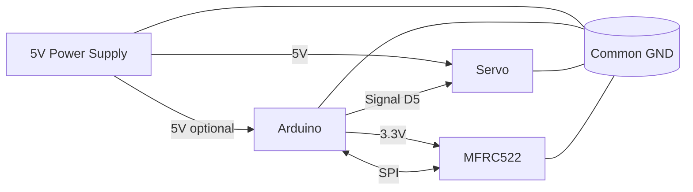

# Wiring Guide (практический)

## 1. Правила безопасности перед включением

1. **Сначала питание отключено**, потом собираем схему.
2. Проверяем полярность 5V/GND дважды.
3. **Общая земля обязательна**: GND Arduino, GND внешнего 5V БП и GND servo должны быть вместе.
4. MFRC522 работает от **3.3V**, не от 5V.

## 2. Подключение MFRC522 к Arduino (SPI)

Пример для Arduino Uno/Nano:
- SDA(SS) -> D10
- SCK -> D13
- MOSI -> D11
- MISO -> D12
- RST -> D9
- 3.3V -> 3.3V
- GND -> GND

> Не подавайте 5V на питание MFRC522.

## 3. Подключение servo

- Servo signal -> D5 (пример)
- Servo VCC -> внешний 5V БП
- Servo GND -> GND внешнего БП
- Arduino GND -> общий GND (соединить с GND внешнего БП)

Рекомендуется поставить конденсатор 470-1000µF между 5V и GND рядом с servo.

## 4. Базовая MVP схема

## 5. Что нельзя делать

- Питать несколько servo от пина 5V Arduino.
- Подключать MFRC522 к 5V питанию.
- Запускать полную интеграцию без smoke-test каждого блока.
- Игнорировать симптомы: reset Arduino, дрожание servo, random RFID reads.

## 6. Типичные ошибки

| Симптом | Вероятная причина | Что делать |
|---|---|---|
| Arduino перезагружается при повороте стрелки | просадка питания | отдельный 5V БП, общий GND, конденсатор |
| RFID не видит карты | неверный SPI pin mapping | сверить SDA/SCK/MISO/MOSI/RST |
| RFID нестабилен | шумное питание/длинные провода | укоротить провода, улучшить GND |
| Servo дрожит | плохое питание/шум сигнала | отдельное питание, проверить пин и механическую нагрузку |
