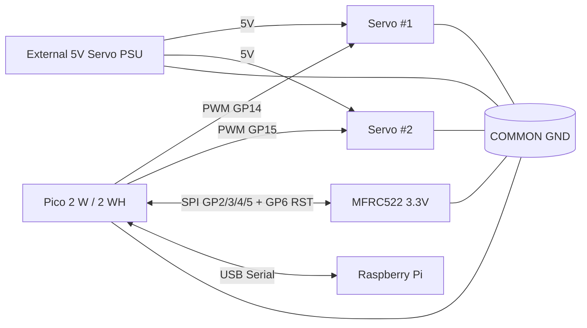

# Wiring Guide (Pico 2 W, практический)

## 1. Правила безопасности перед включением

1. **Сначала питание отключено**, потом собираем схему.
2. Проверяем полярность 5V/GND дважды.
3. **Common ground обязателен**: GND Pico, GND внешнего 5V БП и GND servo должны быть вместе.
4. Pico GPIO — только **3.3V logic** (5V на GPIO запрещены).
5. MFRC522 питается от **3.3V**, не от 5V.

## 2. Pin mapping MVP (рекомендуемый)

### Pico 2 W ↔ MFRC522 (SPI)

| MFRC522 pin | Pico pin | Комментарий |
|---|---|---|
| SDA / SS | GP5 | SPI chip select |
| SCK | GP2 | SPI clock |
| MOSI | GP3 | SPI TX |
| MISO | GP4 | SPI RX |
| RST | GP6 | reset line |
| 3.3V | 3V3(OUT) | питание модуля |
| GND | GND | общая земля |

### Pico 2 W ↔ Servo

| Servo | Pico pin | Питание |
|---|---|---|
| Servo #1 signal | GP14 (PWM) | servo VCC от внешнего 5V PSU |
| Servo #2 signal | GP15 (PWM) | servo VCC от внешнего 5V PSU |
| Servo GND | COMMON GND | обязательно объединить с GND Pico |

### Pico 2 W ↔ Raspberry Pi

| Соединение | Назначение |
|---|---|
| USB data cable | MVP transport: USB Serial |

## 3. Базовая MVP схема

## 4. Что нельзя делать

- Подавать 5V сигнал на любой GPIO Pico.
- Питать servo от 3.3V Pico или от USB линии Pico.
- Подключать 5V UART/TTL устройство к Pico без level shifting.
- Запускать полную интеграцию без smoke-test каждого блока.

## 5. Типичные ошибки

| Симптом | Вероятная причина | Что делать |
|---|---|---|
| Pico перезагружается при повороте стрелки | просадка питания servo | отдельный 5V БП, common GND, конденсатор |
| RFID не видит карты | неверный SPI pin mapping | сверить SDA/SCK/MISO/MOSI/RST |
| RFID нестабилен | шумное питание/длинные провода | укоротить провода, улучшить GND |
| Servo дрожит | плохое питание/шум сигнала | отдельное питание, проверить механику и PWM pin |
| Нет связи с Raspberry Pi | кабель только для зарядки | заменить на USB data cable |
